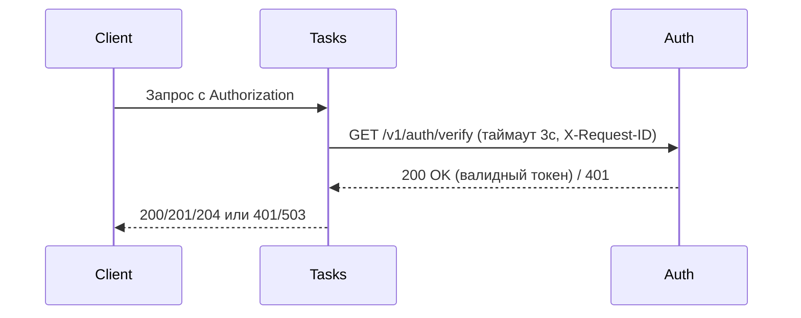
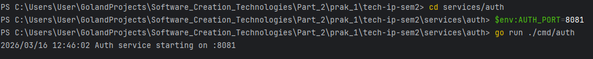
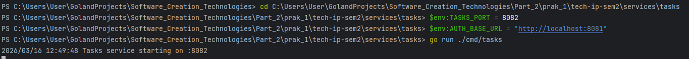
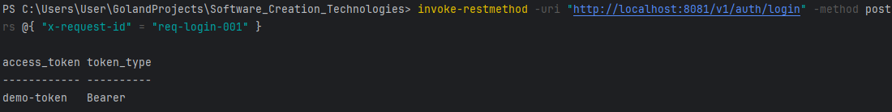
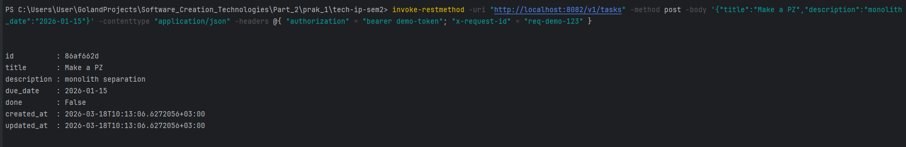
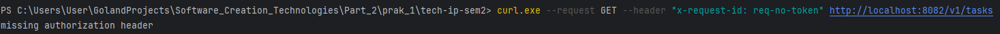
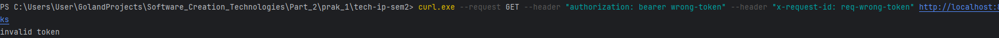
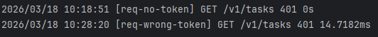
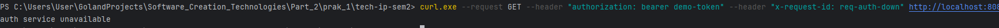
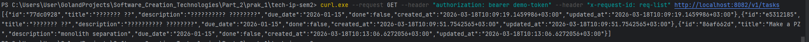

# Tech IP Sem2 – Практическое занятие №1

## Описание решения

Проект состоит из двух микросервисов:
- **Auth service** – отвечает за выдачу и проверку токенов (учебная реализация).
- **Tasks service** – CRUD для задач, перед каждой операцией проверяет токен через Auth.

Взаимодействие синхронное по HTTP. Во все запросы прокидывается `X-Request-ID` для сквозной трассировки, установлены таймауты (3 секунды) на вызов Auth.

## Границы ответственности

- **Auth**: только аутентификация/авторизация (в данном упрощении – проверка фиксированного токена).
- **Tasks**: управление задачами, хранение в памяти, проверка доступа делегируется Auth.

## Схема взаимодействия


# Запуск
## Предварительные требования
### Go 1.18+

Установите зависимости в корне проекта:
```markdown
go mod tidy
```
## Запуск Auth service
```bash
cd services/auth
export AUTH_PORT=8081
go run ./cmd/auth
```
## Запуск Tasks service
```bash
cd services/tasks
export TASKS_PORT=8082
export AUTH_BASE_URL=http://localhost:8081
go run ./cmd/tasks
```

## Переменные окружения
```markdown
Сервис	Переменная	Значение по умолчанию	Описание
Auth	AUTH_PORT	8081	Порт, на котором слушает Auth
Tasks	TASKS_PORT	8082	Порт Tasks
Tasks	AUTH_BASE_URL	http://localhost:8081	Базовый URL для вызова Auth
```
## Примеры запросов
### Получить токен
```bash
curl -s -X POST http://localhost:8081/v1/auth/login \
  -H "Content-Type: application/json" \
  -H "X-Request-ID: req-001" \
  -d '{"username":"student","password":"student"}'
```
### Создать задачу (с токеном)
```bash
curl -i -X POST http://localhost:8082/v1/tasks \
  -H "Content-Type: application/json" \
  -H "Authorization: Bearer demo-token" \
  -H "X-Request-ID: req-002" \
  -d '{"title":"Выполнить ПЗ","description":"разделение монолита","due_date":"2026-01-15"}'
```
### Попытка без токена (ожидается 401)
```bash
curl -i http://localhost:8082/v1/tasks -H "X-Request-ID: req-003"
```
## Полная документация API – в файле docs/pz17_api.md.

# Скриншот 1: Запуск Auth service
## Файл: picture/skrin_1.png

Что видно на скриншоте:

```powershell
cd services/auth
$env:AUTH_PORT = 8081
go run ./cmd/auth
```

Лог сервиса: Auth service starting on :8081.


# Скриншот 2: Запуск Tasks service
## Файл: picture/skrin_2.png
Что видно на скриншоте:

```powershell
$env:TASKS_PORT = 8082
$env:AUTH_BASE_URL = "http://localhost:8081"
go run ./cmd/tasks
```

Лог сервиса: Tasks service starting on :8082.

Подтверждение, что Tasks ожидает запросы.


# Скриншот 3: Получение токена через Auth service
## Файл: picture/skrin_3.png
Что видно на скриншоте:
```json
Команда invoke-restmethod для отправки POST-запроса на 
/v1/auth/login с телом {"username":"student","password":"student"} и 
заголовком X-Request-ID: req-login-001.
        
Ответ сервера: JSON-объект с полями access_token и 
token_type (значение demo-token и Bearer).
```

Подтверждение, что токен успешно получен.



# Скриншот 4: Создание задачи с прокидыванием request-id
## Файл: picture/skrin_4.png
Что видно на скриншоте:

Команда invoke-restmethod (или curl) для создания задачи:
POST /v1/tasks с заголовками Authorization: Bearer demo-token и X-Request-ID: req-demo-123.

Тело запроса: {"title":"Сделать ПЗ","description":"разделение монолита","due_date":"2026-01-15"}.

Ответ сервера: статус 201 Created и JSON созданной задачи (поля id, title, description, due_date, done).

В логах Auth service видна запись с тем же req-demo-123 и статусом 200 для эндпоинта /v1/auth/verify.

В логах Tasks service – запись с req-demo-123 и статусом 201.

Демонстрация сквозной трассировки запроса.


# Скриншот 5: Запрос к Tasks без токена (401)
## Файл: picture/skrin_5.png
Что видно на скриншоте:
```markdown
Команда запроса списка задач без заголовка Authorization.

Ошибка: missing authorization header и код 401.

В логах Tasks service – запись с req-no-token и статусом 401.(Общий скрин 4 и 5 ошибки ниже)
```


# Скриншот 6: Запрос к Tasks с неверным токеном (401)
## Файл: picture/skrin_6.png
Что видно на скриншоте:

```markdown
Команда запроса с заголовком Authorization: Bearer wrong-token.

Ошибка: unauthorized (или аналогичное сообщение) с кодом 401.

В логах Tasks service – запись с req-wrong-token и статусом 401.
```


## Скриншот общих ошибок в Tasks
На этом скриншоте показаны записи из логов Tasks service, подтверждающие, что сервис 
корректно отвечает статусом 401 на запросы без токена и с неверным токеном (request-id 
req-no-token и req-wrong-token).


# Скриншот 7: Auth service недоступен (503)
## Файл: picture/skrin_7.png
Что видно на скриншоте:

```markdown
Auth service остановлен (в окне 1 нажат Ctrl+C).

Команда запроса к Tasks с правильным токеном (Authorization: Bearer demo-token) и X-Request-ID: req-auth-down.

Ошибка: The remote server returned an error: (503) Service Unavailable.

В логах Tasks service – запись с req-auth-down и статусом 503 (или 502), подтверждающая, что Tasks корректно обрабатывает недоступность Auth.
```
Подтверждение, что Tasks корректно обрабатывает недоступность Auth.

# Скриншот 8: Получение списка задач после восстановления Auth
## Файл: picture/skrin_8.png
Что видно на скриншоте:

```markdown
Auth service запущен заново.

Команда GET /v1/tasks с заголовками Authorization: Bearer demo-token и X-Request-ID: req-list.

Ответ: массив задач в формате JSON (содержит задачу, созданную на шаге 4).

В логах Auth и Tasks – записи с req-list и статусами 200, подтверждающие полную работоспособность системы после восстановления.
```


