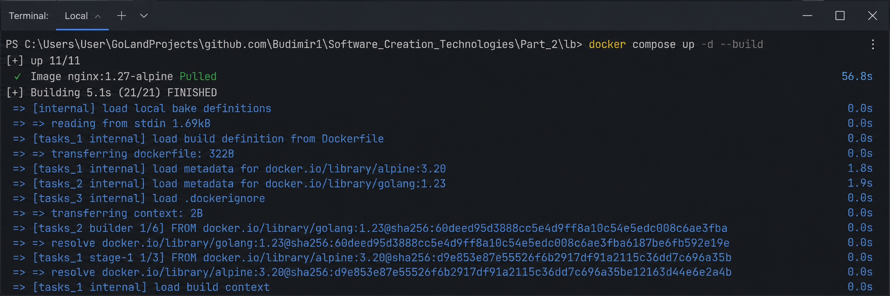
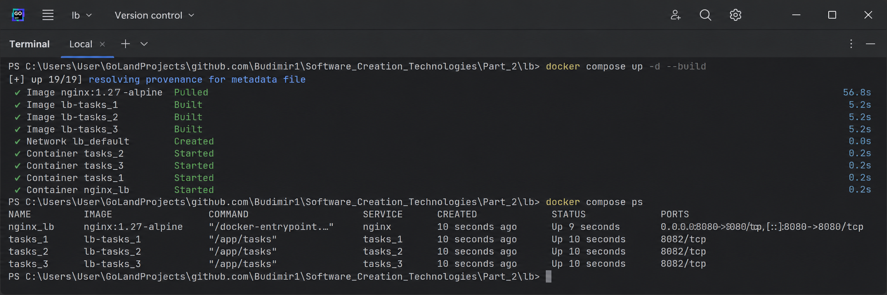
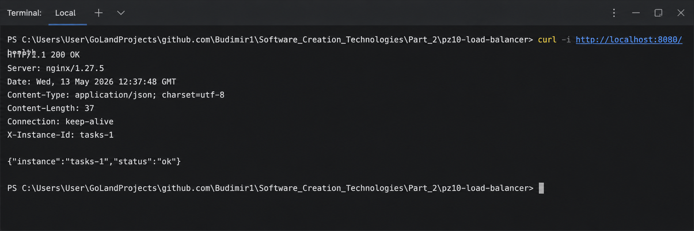
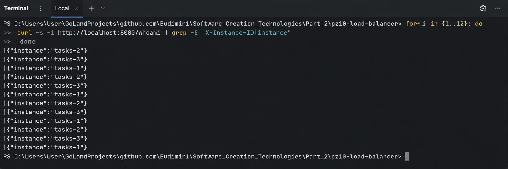
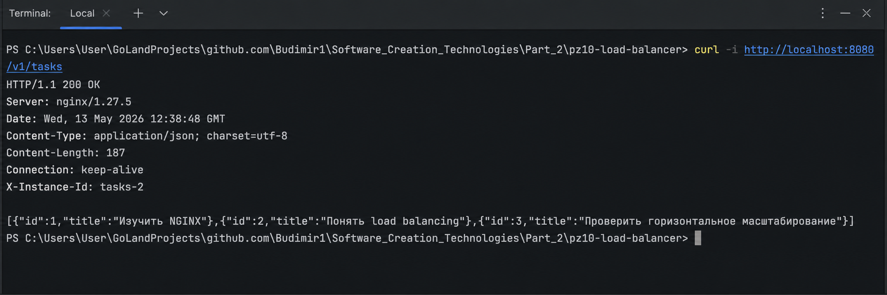
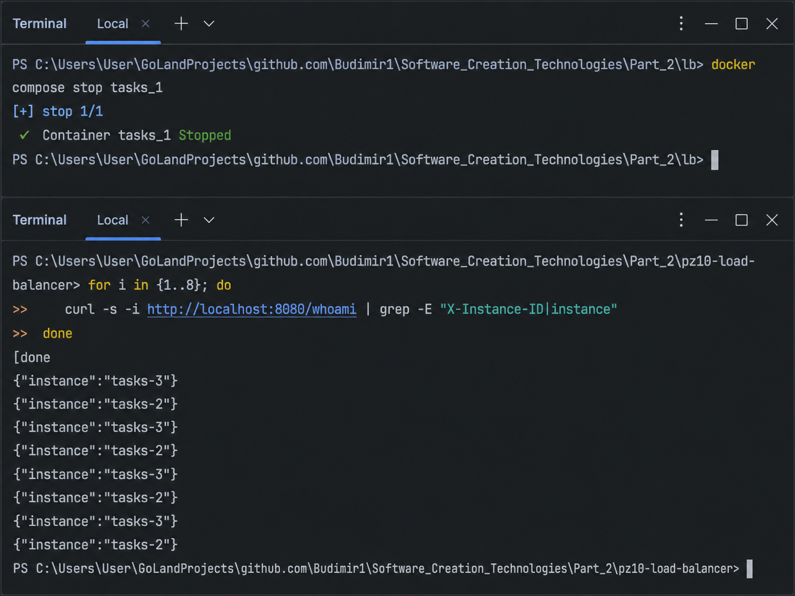
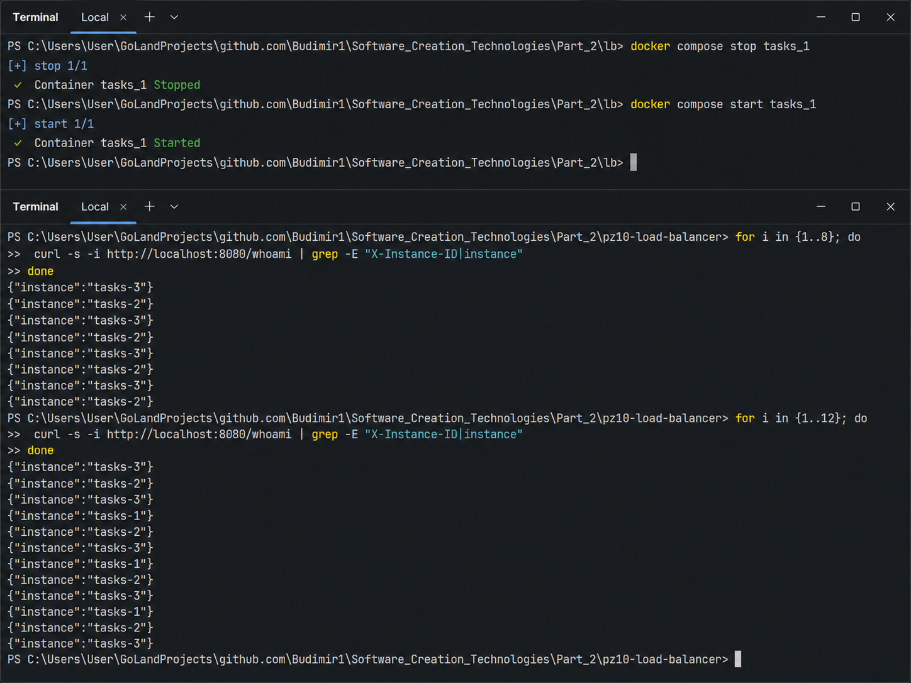

# pz10-load-balancer

Практическое занятие №10: горизонтальное масштабирование backend-сервиса на Go через NGINX Load Balancer.

## Что реализовано

- Go HTTP-сервис `tasks`.
- Health endpoint: `GET /health`.
- Endpoint списка задач: `GET /v1/tasks`.
- Endpoint идентификации реплики: `GET /whoami`.
- Заголовок `X-Instance-ID` в ответах.
- Логирование входящих запросов с указанием `INSTANCE_ID`.
- 3 реплики backend-сервиса.
- NGINX reverse proxy/load balancer.
- Проверка отказоустойчивости при остановке одной реплики.

## Структура

```text
pz10-load-balancer/
  services/
    tasks/
      cmd/
        server/
          main.go
      go.mod
      Dockerfile
  deploy/
    lb/
      docker-compose.yml
      nginx.conf
```

## Запуск через Docker Compose

```bash
cd deploy/lb
docker compose up -d --build
```

Проверка контейнеров:

```bash
docker compose ps
```

## Проверка health endpoint

```bash
curl -i http://localhost:8080/health
```

## Проверка балансировки

```bash
for i in {1..12}; do
  curl -s -i http://localhost:8080/whoami | grep -E "X-Instance-ID|instance"
done
```

Ожидается, что ответы будут приходить от разных реплик: `tasks-1`, `tasks-2`, `tasks-3`.

## Проверка списка задач

```bash
curl -i http://localhost:8080/v1/tasks
```

## Проверка прокидывания Authorization

```bash
curl -i http://localhost:8080/v1/tasks -H "Authorization: Bearer demo-token"
```

## Проверка отказоустойчивости

Остановить одну реплику:

```bash
docker compose stop tasks_1
```

Повторить запросы:

```bash
for i in {1..8}; do
  curl -s -i http://localhost:8080/whoami | grep -E "X-Instance-ID|instance"
done
```

Вернуть реплику:

```bash
docker compose start tasks_1
```

## Просмотр логов

```bash
docker logs tasks_1
docker logs tasks_2
docker logs tasks_3
docker logs nginx_lb
```

## Остановка стенда

```bash
cd deploy/lb
docker compose down
```

## Скриншоты:

----

----

----

----

----

----

----