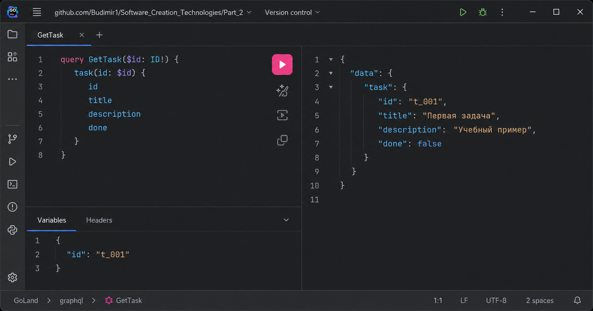
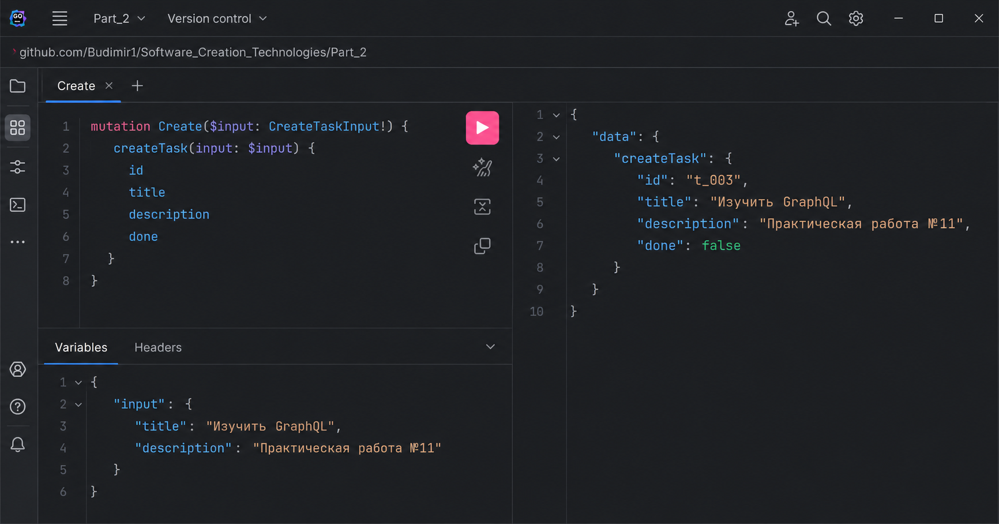
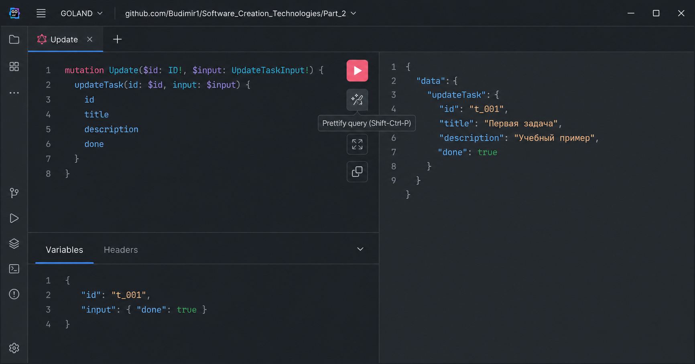

# Практическое занятие №11 — GraphQL API на Go с gqlgen

## Что реализовано

- GraphQL-схема для сущности `Task`.
- 2 Query:
  - `tasks` — получить список задач;
  - `task(id: ID!)` — получить одну задачу по идентификатору.
- 3 Mutation:
  - `createTask(input: CreateTaskInput!)` — создать задачу;
  - `updateTask(id: ID!, input: UpdateTaskInput!)` — обновить задачу;
  - `deleteTask(id: ID!)` — удалить задачу.
- Отдельные слои приложения:
  - `graph/` — GraphQL-схема и резолверы;
  - `internal/domain/` — доменная модель;
  - `internal/repository/` — in-memory репозиторий;
  - `internal/service/` — сервисный слой и валидация.
- GraphQL Playground по адресу `http://localhost:8080/`.
- Endpoint GraphQL API: `http://localhost:8080/query`.

## Структура проекта

```text
pz11-graphql/
├── graph/
│   ├── generated/              # создаётся командой gqlgen generate
│   ├── model/                  # создаётся командой gqlgen generate
│   ├── resolver.go
│   ├── schema.graphqls
│   └── schema.resolvers.go
├── internal/
│   ├── domain/
│   │   └── task.go
│   ├── repository/
│   │   └── task_repository.go
│   └── service/
│       └── task_service.go
├── scripts/
│   ├── bootstrap.sh
│   └── check_api.sh
├── go.mod
├── gqlgen.yml
├── Makefile
├── README.md
└── server.go
```

## Требования для macOS

```bash
go version
```

Если Go не установлен, установить через Homebrew:

```bash
brew update
brew install go
```


## Команды запуска от А до Я

### 1. Сгенерировать каркас gqlgen и скачать зависимости

Основной вариант:

```bash
chmod +x scripts/bootstrap.sh
./scripts/bootstrap.sh
```

Альтернативный вариант через `make`:

```bash
make bootstrap
```

Что делает скрипт:

```bash
go run github.com/99designs/gqlgen@v0.17.49 generate
go mod tidy
gofmt -w server.go graph/*.go internal/**/*.go
go test ./...
```

### 4. Запустить GraphQL-сервер

```bash
go run ./server.go
```

Или через Makefile:

```bash
make run
```

После запуска в терминале появится примерно такой вывод:

```text
GraphQL Playground: http://localhost:8080/
GraphQL endpoint:   http://localhost:8080/query
```

### 5. Открыть Playground

Откройте в браузере:

```text
http://localhost:8080/
```

### 6. Проверить API через curl

В новом терминале выполните:

```bash
cd ~/Downloads/pz11-graphql
./scripts/check_api.sh
```

Или вручную:

```bash
curl -sS -X POST http://localhost:8080/query \
  -H 'Content-Type: application/json' \
  -d '{"query":"query { tasks { id title description done } }"}'
```

## GraphQL-схема


Обновление:
```graphql
mutation Update($id: ID!, $input: UpdateTaskInput!) {
  updateTask(id: $id, input: $input) {
    id
    title
    description
    done
  }
}
```
Variables:
```json
{
  "id": "t_001",
  "input": { "done": true }
}
```



Удаление:
```graphql
mutation Delete($id: ID!) {
  deleteTask(id: $id)
}
```
Variables:
```json
{ "id": "t_002" }
```




## Контрольные вопросы

### 1. Что такое GraphQL и в чём его основное отличие от REST API?

GraphQL — это язык запросов к API и среда выполнения запросов на сервере. Основное отличие от REST состоит в том, что в REST клиент обращается к разным endpoint-ам и получает заранее заданный формат ответа, а в GraphQL клиент отправляет запрос на единый endpoint и сам указывает, какие поля ему нужны.

### 2. Для чего используется GraphQL-схема?

GraphQL-схема описывает контракт API: типы данных, доступные запросы, доступные мутации и входные параметры. По схеме клиент понимает, какие операции можно выполнять, а сервер — какие резолверы нужно реализовать.

### 3. Чем Query отличается от Mutation?

`Query` используется для чтения данных без изменения состояния системы. `Mutation` используется для операций, которые меняют состояние: создание, обновление, удаление данных.

### 4. Что такое резолвер и какую роль он выполняет?

Резолвер — это функция на сервере, которая выполняет конкретное поле GraphQL-запроса или мутации. В этом проекте резолверы принимают GraphQL-входные данные, вызывают сервисный слой и возвращают результат клиенту.

### 5. Почему GraphQL позволяет уменьшить over-fetching данных?

GraphQL позволяет клиенту явно перечислить поля, которые нужны в ответе. Поэтому сервер не обязан возвращать лишние поля, как это часто происходит в REST API с фиксированным форматом ответа.

### 6. Для чего используется библиотека gqlgen в Go-проекте?

`gqlgen` используется для создания GraphQL-сервера на Go по подходу schema-first. Разработчик описывает GraphQL-схему, затем `gqlgen` генерирует типы, интерфейсы и серверный каркас, а разработчик реализует бизнес-логику в резолверах.

### 7. Почему желательно использовать общий сервисный или репозиторный слой для REST и GraphQL?

Общий слой позволяет не дублировать бизнес-логику. REST-обработчики и GraphQL-резолверы могут обращаться к одним и тем же сервисам и репозиториям, поэтому правила валидации, работа с данными и ошибки остаются едиными.

### 8. Что произойдёт, если GraphQL-запрос попытается получить слишком большой объём данных?

Сервер может начать потреблять слишком много CPU, памяти или сетевых ресурсов. В реальных проектах для защиты применяют лимиты глубины запроса, лимиты сложности, пагинацию, таймауты и авторизацию.

### 9. Какие преимущества даёт Playground при тестировании API?

Playground позволяет выполнять запросы и мутации прямо из браузера, передавать переменные, видеть результат, изучать схему и быстро проверять работу резолверов без отдельного frontend-приложения.

### 10. В каких случаях GraphQL особенно удобен на практике?

GraphQL особенно удобен, когда клиентам нужны разные наборы полей, когда важно уменьшить количество запросов к серверу, когда API используется несколькими frontend-клиентами и когда требуется единый гибкий endpoint поверх существующей бизнес-логики.
