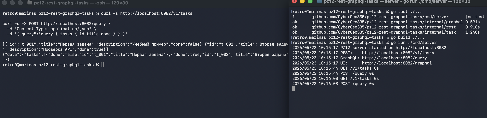
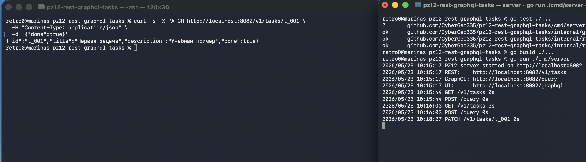
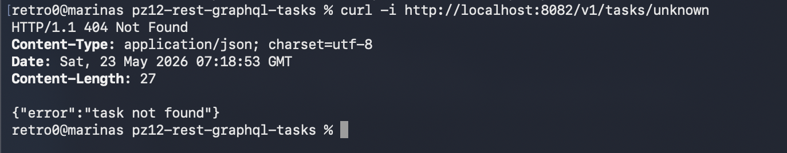
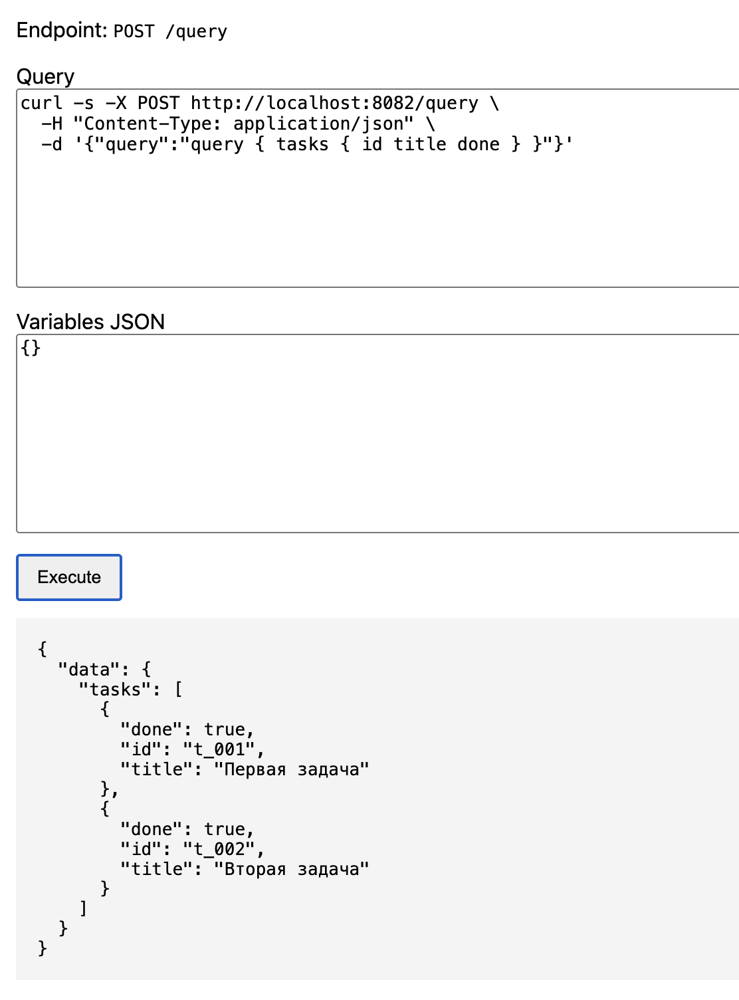
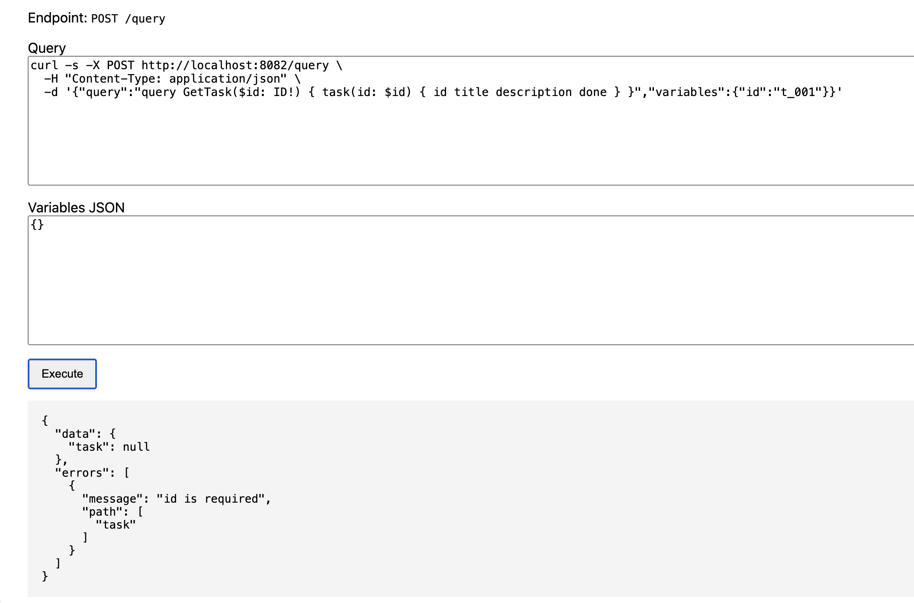

# Практическое занятие №12 — REST и GraphQL для сущности Task

Проект реализует один и тот же функционал для сущности `Task` двумя способами:

1. REST API;
2. GraphQL API.


---

## 1. Выбранный пользовательский сценарий

Для сравнения REST и GraphQL выбран единый сценарий:

1. экран списка задач показывает только поля `id`, `title`, `done`;
2. экран деталей одной задачи показывает поля `id`, `title`, `description`, `done`;
3. дополнительное действие изменения данных — создание задачи и обновление признака `done`.

Обе реализации используют одну модель данных и один общий in-memory репозиторий.

---

## 2. Модель данных

```go
type Task struct {
    ID          string `json:"id"`
    Title       string `json:"title"`
    Description string `json:"description"`
    Done        bool   `json:"done"`
}
```

Стартовые данные:

```json
[
  {
    "id": "t_001",
    "title": "Первая задача",
    "description": "Учебный пример",
    "done": false
  },
  {
    "id": "t_002",
    "title": "Вторая задача",
    "description": "Проверка API",
    "done": true
  }
]
```

---

## 3. Структура проекта

```text
pz12-rest-graphql-tasks/
├── cmd/
│   └── server/
│       └── main.go
├── internal/
│   ├── graphql/
│   │   ├── handler.go
│   │   ├── handler_test.go
│   │   └── schema.graphqls
│   ├── rest/
│   │   ├── handler.go
│   │   ├── handler_test.go
│   │   └── schema.graphqls
│   └── task/
│       ├── model.go
│       ├── repository.go
│       └── repository_test.go
├── .gitignore
├── go.mod
└── README.md
```

---

## 4. Команды от А до Я для macO

### Шаг 1. Запустить тесты

```bash
go test ./...
```

Ожидаемый результат:

```text
ok   github.com/CyberGeo335/pz12-rest-graphql-tasks/internal/graphql
ok   github.com/CyberGeo335/pz12-rest-graphql-tasks/internal/rest
ok   github.com/CyberGeo335/pz12-rest-graphql-tasks/internal/task
```

### Шаг 2. Собрать проект

```bash
go build ./...
```

### Шаг 3. Запустить сервер

```bash
go run ./cmd/server
```

Сервер запускается на порту `8082`.

Ожидаемые адреса:

```text
REST:    http://localhost:8082/v1/tasks
GraphQL: http://localhost:8082/query
UI:      http://localhost:8082/graphql
```

### Шаг 4. Открыть второй терминал

Сервер должен продолжать работать в первом терминале. Во втором терминале выполните команды ниже.

---

## 5. Проверка REST API

### 5.1. Health-check

```bash
curl -s http://localhost:8082/health
```

Ожидаемый ответ:

```json
{"status":"ok"}
```

### 5.2. Получить список задач

```bash
curl -s http://localhost:8082/v1/tasks
```

REST возвращает полную структуру задачи, включая `description`:

```json
[
  {
    "id": "t_001",
    "title": "Первая задача",
    "description": "Учебный пример",
    "done": false
  },
  {
    "id": "t_002",
    "title": "Вторая задача",
    "description": "Проверка API",
    "done": true
  }
]
```

Для экрана списка поле `description` является лишним, потому что экран использует только `id`, `title`, `done`.

### 5.3. Получить одну задачу

```bash
curl -s http://localhost:8082/v1/tasks/t_001
```

Ожидаемый ответ:

```json
{
  "id": "t_001",
  "title": "Первая задача",
  "description": "Учебный пример",
  "done": false
}
```

### 5.4. Создать задачу

```bash
curl -s -X POST http://localhost:8082/v1/tasks \
  -H "Content-Type: application/json" \
  -d '{"title":"Compare REST and GraphQL","description":"PZ12"}'
```

Ожидаемый ответ:

```json
{
  "id": "t_003",
  "title": "Compare REST and GraphQL",
  "description": "PZ12",
  "done": false
}
```

### 5.5. Обновить признак `done`

```bash
curl -s -X PATCH http://localhost:8082/v1/tasks/t_001 \
  -H "Content-Type: application/json" \
  -d '{"done":true}'
```

Ожидаемый ответ:

```json
{
  "id": "t_001",
  "title": "Первая задача",
  "description": "Учебный пример",
  "done": true
}
```

### 5.6. Проверить ошибку REST

```bash
curl -i http://localhost:8082/v1/tasks/unknown
```

Ожидаемый результат:

```text
HTTP/1.1 404 Not Found
```

Тело ответа:

```json
{
  "error": "task not found"
}
```

---

## 6. Проверка GraphQL API

GraphQL endpoint:

```text
POST http://localhost:8082/query
```

Также доступна простая учебная HTML-страница:

```text
http://localhost:8082/graphql
```

### 6.1. Получить список задач только с нужными полями

```bash
curl -s -X POST http://localhost:8082/query \
  -H "Content-Type: application/json" \
  -d '{"query":"query { tasks { id title done } }"}'
```

Ожидаемый ответ:

```json
{
  "data": {
    "tasks": [
      {
        "id": "t_001",
        "title": "Первая задача",
        "done": false
      },
      {
        "id": "t_002",
        "title": "Вторая задача",
        "done": true
      }
    ]
  }
}
```

В этом ответе нет поля `description`, потому что клиент его не запросил.

### 6.2. Получить одну задачу

```bash
curl -s -X POST http://localhost:8082/query \
  -H "Content-Type: application/json" \
  -d '{"query":"query GetTask($id: ID!) { task(id: $id) { id title description done } }","variables":{"id":"t_001"}}'
```

Ожидаемый ответ:

```json
{
  "data": {
    "task": {
      "id": "t_001",
      "title": "Первая задача",
      "description": "Учебный пример",
      "done": false
    }
  }
}
```

### 6.3. Создать задачу

```bash
curl -s -X POST http://localhost:8082/query \
  -H "Content-Type: application/json" \
  -d '{"query":"mutation Create($input: CreateTaskInput!) { createTask(input: $input) { id title description done } }","variables":{"input":{"title":"Сравнить REST и GraphQL","description":"Практическая работа №12"}}}'
```

Ожидаемый ответ:

```json
{
  "data": {
    "createTask": {
      "id": "t_003",
      "title": "Сравнить REST и GraphQL",
      "description": "Практическая работа №12",
      "done": false
    }
  }
}
```

---

## 7. Сравнение количества запросов

Сценарий: список задач → открыть детали → обновить `done`.

| Шаг | REST | GraphQL |
|---|---|---|
| Получить список задач | `GET /v1/tasks` | `query { tasks { id title done } }` |
| Получить детали задачи | `GET /v1/tasks/t_001` | `query GetTask($id: ID!) { task(id: $id) { id title description done } }` |
| Обновить `done` | `PATCH /v1/tasks/t_001` | `mutation Update(...) { updateTask(...) { ... } }` |
| Итого | 3 сетевых обращения | 3 сетевых обращения |

Вывод: в выбранном простом CRUD-сценарии количество сетевых обращений одинаковое. Преимущество GraphQL проявляется не в уменьшении количества запросов, а в более точном выборе полей ответа.

---

## 8. Сравнение объёма данных

Для экрана списка задач нужны только поля:

```text
id, title, done
```

REST endpoint `GET /v1/tasks` возвращает:

```text
id, title, description, done
```

Поле `description` для списка является лишним. Это пример `over-fetching`.

GraphQL-запрос:

```graphql
query {
  tasks {
    id
    title
    done
  }
}
```

возвращает только нужные поля.

### Команды для количественного сравнения

```bash
curl -s http://localhost:8082/v1/tasks -o rest-list.json

curl -s -X POST http://localhost:8082/query \
  -H "Content-Type: application/json" \
  -d '{"query":"query { tasks { id title done } }"}' \
  -o graphql-list.json

wc -c rest-list.json graphql-list.json
```

REST-ответ будет больше, потому что содержит поле `description` у каждой задачи.

---

## 9. Сравнение обработки ошибок

| Ситуация | REST | GraphQL |
|---|---|---|
| Несуществующая задача | HTTP `404 Not Found` и тело `{"error":"task not found"}` | HTTP `200 OK`, `data.task = null`, ошибка в массиве `errors` |
| Ошибка формата JSON | HTTP `400 Bad Request` | HTTP `400 Bad Request` для некорректного JSON-конверта |
| Ошибка бизнес-валидации | HTTP `400 Bad Request` | HTTP `200 OK` и поле `errors` |

REST проще анализировать на уровне HTTP-инфраструктуры: статус сразу показывает класс ошибки. GraphQL удобен для клиентских приложений, где один ответ может содержать частичные данные и список ошибок, но для мониторинга нужно отдельно учитывать поле `errors`.

---

## 10. Сравнение документирования и тестирования

REST:

- несколько URL;
- операции разделены HTTP-методами;
- легко тестировать через `curl`;
- удобно описывать через Swagger/OpenAPI;
- новичку проще понять связь между URL, методом и действием.

GraphQL:

- один endpoint `/query`;
- клиент сам выбирает поля;
- схема обычно самодокументируемая;
- удобно работать через Playground/GraphiQL;
- нужно понимать `query`, `mutation`, переменные и типы.

В учебном CRUD-контексте REST оказался проще для начального запуска и проверки. GraphQL оказался гибче при выборе полей ответа.

---

## 11. Сравнение кэширования

REST проще кэшировать стандартными средствами HTTP, потому что разные ресурсы имеют разные URL:

```text
GET /v1/tasks
GET /v1/tasks/t_001
```

Для таких запросов проще использовать `ETag`, `Cache-Control`, reverse proxy cache и browser cache.

GraphQL обычно использует один endpoint:

```text
POST /query
```

Из-за этого стандартное HTTP-кэширование по URL работает хуже. В GraphQL чаще используют дополнительные подходы: persisted queries, client-side cache, DataLoader, кэширование на уровне резолверов или бизнес-данных.

---

## 12. Итоговая сравнительная таблица

| Критерий | REST | GraphQL |
|---|---|---|
| Структура API | Несколько endpoint | Один endpoint |
| Выбор полей | Определяет сервер | Определяет клиент |
| Избыточность ответа | Возможна | Обычно ниже |
| Количество запросов в данном сценарии | 3 | 3 |
| Ошибки | HTTP-статусы и JSON-тело | Поле `errors` в JSON-ответе |
| Кэширование | Проще стандартными HTTP-средствами | Сложнее, нужны дополнительные механизмы |
| Простота внедрения | Выше | Ниже |
| Гибкость клиента | Ниже | Выше |
| Тестирование через curl | Очень простое | Чуть сложнее из-за JSON-конверта запроса |
| Документирование | Swagger/OpenAPI | Схема GraphQL и Playground |

---
## 12.2 Скриншоты

----

----

----

----



## 13. Итоговый вывод

В рамках выбранного сценария оба подхода позволяют реализовать один и тот же функционал: получить список задач, открыть одну задачу, создать задачу и обновить признак `done`. Количество сетевых обращений для сценария «список → детали → обновление» оказалось одинаковым: REST выполняет три запроса, GraphQL тоже выполняет три операции. Главное отличие проявилось в структуре данных. REST endpoint списка возвращает фиксированную модель задачи и отдаёт поле `description`, хотя экран списка его не использует. GraphQL позволяет клиенту явно указать только поля `id`, `title`, `done`, поэтому ответ точнее соответствует потребности интерфейса. С точки зрения ошибок REST выглядит проще, потому что использует привычные HTTP-статусы: `404`, `400`, `500`. В GraphQL ошибка чаще находится внутри поля `errors`, поэтому клиент и мониторинг должны дополнительно анализировать JSON-тело ответа. В вопросе кэширования REST также проще, потому что ресурсы имеют отдельные URL. GraphQL даёт преимущество там, где есть разные клиенты, разные экраны и необходимость гибко выбирать состав данных. Для простого учебного CRUD-сервиса REST является более практичным и быстрым в реализации. Для сложного интерфейса с множеством вариантов представления данных GraphQL может быть более удобным решением.

---

## 14. Контрольные вопросы и ответы

### 1. В чём принципиальное отличие REST и GraphQL?

REST строится вокруг ресурсов, URL и HTTP-методов. GraphQL строится вокруг единого endpoint и запроса, в котором клиент сам описывает нужные поля и структуру ответа.

### 2. Что такое over-fetching и under-fetching?

`Over-fetching` — ситуация, когда клиент получает больше данных, чем ему нужно. `Under-fetching` — ситуация, когда одного запроса недостаточно, поэтому клиент вынужден делать дополнительные запросы.

### 3. Почему GraphQL позволяет клиенту точнее выбирать поля ответа?

Потому что в GraphQL клиент указывает selection set: список полей, которые должны быть возвращены. Сервер формирует ответ в соответствии с этим списком.

### 4. Почему REST проще кэшировать стандартными средствами HTTP?

REST использует разные URL для разных ресурсов. Поэтому стандартные механизмы `Cache-Control`, `ETag`, reverse proxy cache и browser cache проще применить к конкретному URL.

### 5. Чем отличается обработка ошибок в REST и GraphQL?

В REST ошибка обычно выражается HTTP-статусом и JSON-телом. В GraphQL при корректно обработанном запросе HTTP-статус часто остаётся `200 OK`, а сведения об ошибке передаются в поле `errors`.

### 6. В каких случаях REST оказывается более практичным решением?

REST практичнее для простых CRUD-сервисов, внутренних административных API, микросервисов с предсказуемыми ресурсами и проектов, где важны простота, кэширование и понятная интеграция с HTTP-инфраструктурой.

### 7. В каких случаях GraphQL может дать преимущества?

GraphQL полезен, когда есть несколько клиентов с разными потребностями в данных: web, mobile, admin UI. Он также удобен, когда нужно уменьшить избыточность ответа и дать клиенту контроль над набором полей.

### 8. Почему корректное сравнение REST и GraphQL нужно проводить на одном и том же сценарии?

Если сравнивать разные сценарии, вывод будет некорректным. Нужно сравнивать одинаковую модель, одинаковые операции и одинаковые пользовательские потребности.

### 9. Какие сложности возникают при сопровождении GraphQL API?

Нужно поддерживать схему, резолверы, типы, обработку ошибок, контроль сложности запросов, авторизацию на уровне полей и отдельные подходы к кэшированию и мониторингу.

### 10. Почему для учебных CRUD-сервисов REST часто оказывается проще?

Потому что CRUD естественно выражается через HTTP-методы и URL: `GET`, `POST`, `PATCH`, `DELETE`. Такой API легче написать, протестировать через `curl` и объяснить начинающему разработчику.

---

## 15. Остановка сервера

В терминале, где запущен сервер, нажмите:

```bash
Control + C
```

---

## 16. Что не делалось специально

- `git init` не выполнялся;
- install-скрипты не создавались;
- shell-скрипты для запуска команд не создавались;
- зависимости не устанавливались автоматически;
- все команды приведены отдельно в README.
