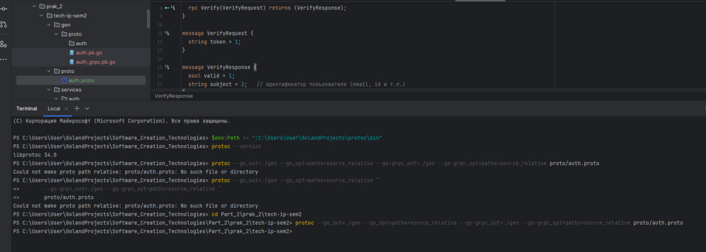
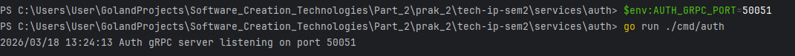
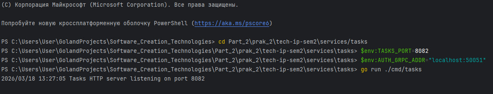
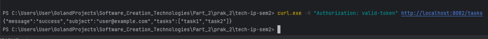
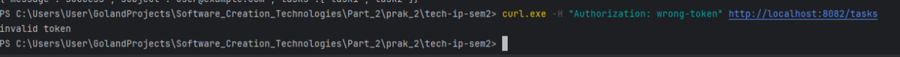
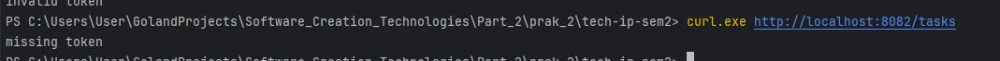
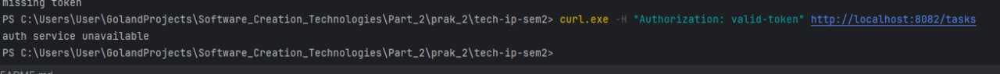

# Практическое занятие №2: gRPC: создание простого микросервиса, вызовы методов
## Описание проекта
В данной работе реализованы два микросервиса:
```markdown
Auth — gRPC-сервер, предоставляющий метод Verify для проверки JWT-токена.

Tasks — HTTP-сервер (оставлен от предыдущего задания), который для аутентификации запросов вызывает gRPC-метод Verify сервиса Auth.
```
Таким образом, проверка токена вынесена в отдельный сервис и осуществляется по gRPC с использованием контракта, описанного в Protocol Buffers.
### Структура проекта 
```markdown
tech-ip-sem2/
├── proto/
│   └── auth.proto                # контракт gRPC
├── gen/                           # сгенерированный код (после protoc)
│   └── proto/
│       └── auth/
│           ├── auth.pb.go
│           └── auth_grpc.pb.go
├── services/
│   ├── auth/
│   │   ├── cmd/
│   │   │   └── auth/
│   │   │       └── main.go        # точка входа Auth (gRPC сервер)
│   │   └── internal/
│   │       └── grpc/
│   │           └── server.go      # реализация AuthService
│   └── tasks/
│       ├── cmd/
│       │   └── tasks/
│       │       └── main.go        # точка входа Tasks (HTTP сервер)
│       └── internal/
│           └── handlers/
│               └── task_handler.go # HTTP обработчик с gRPC клиентом
├── go.mod
└── go.sum
```
## Предварительные требования
```json
Установленный Go (версия 1.18+)

Установленные инструменты:

  protoc (компилятор Protocol Buffers)

  плагины protoc-gen-go и protoc-gen-go-grpc
```
### Установка плагинов:
```bash
go install google.golang.org/protobuf/cmd/protoc-gen-go@latest
go install google.golang.org/grpc/cmd/protoc-gen-go-grpc@latest
```
Убедитесь, что $GOPATH/bin добавлен в PATH

## Генерация кода из proto-файла
Контракт находится в 
```markdown proto/auth.proto ```

### Сгенерируйте код клиента и сервера, выполнив из корня проекта:

```bash
protoc --go_out=. --go-grpc_out=. proto/auth.proto
```
После выполнения в папке gen/proto появятся файлы:
```markdown
auth.pb.go (структуры сообщений)

auth_grpc.pb.go (интерфейсы сервера и клиента)
```



# Запуск

## Скрин 1. Запуск Auth (gRPC-сервер)

```powershell
    cd auth
    export AUTH_GRPC_PORT=50051
    go run ./cmd/auth
```


## Скрин 2. Запуск Tasks (HTTP сервер)

```powershell
    cd services/tasks
    $env:TASKS_PORT=8082
    $env:AUTH_GRPC_ADDR="localhost:50051"
    go run ./cmd/tasks
```


# Тестирование

## Успешный запрос
```bash
curl -H "Authorization: valid-token" http://localhost:8082/tasks
```
Ответ (HTTP 200):


В логах Tasks появится строка:
```markdown
calling grpc verify
```


## Невалидный токен
```bash
curl -H "Authorization: wrong-token" http://localhost:8082/tasks
```

Ответ: invalid token (HTTP 401)



## Отсутствие токена

```bash
curl http://localhost:8082/tasks
```

Ответ: missing token (HTTP 401)



## Auth сервис недоступен
Останавливаем Auth (Ctrl+C) и выполняем запрос с правильным токеном:
```bash
curl -H "Authorization: valid-token" http://localhost:8082/tasks
```
(HTTP 503) — клиент не дождался ответа из-за таймаута.



# Обработка ошибок и маппинг gRPC → HTTP

```markdown
| gRPC код              | HTTP статус                        | Описание                              |
|-----------------------|-------------------------------------|---------------------------------------|
| `Unauthenticated`     | 401 Unauthorized                    | Неверный или отсутствующий токен      |
| `DeadlineExceeded`    | 504 Gateway Timeout                 | Таймаут при вызове Auth               |
| `Unavailable`         | 503 Service Unavailable             | Auth сервис не отвечает                |
| Прочие (`Internal`    | 500 Internal Server Error       | Внутренняя ошибка                     |
```

## Контрольные вопросы
### 1. Что такое .proto и почему он считается контрактом?
.proto — файл, описывающий структуры данных и интерфейсы сервиса. Он является контрактом, так как определяет формат запросов/ответов, который должен соблюдаться и клиентом, и сервером для успешного взаимодействия.

### 2. Что такое deadline в gRPC и чем он полезен?
Deadline — максимальное время ожидания ответа от сервера. Позволяет избежать зависаний, освобождать ресурсы и реализовывать таймауты в распределённых системах.

### 3. Почему "exactly-once" не даётся просто так даже в RPC?
Из-за возможных сбоев сети, таймаутов и отсутствия глобальной транзакции клиент не может гарантировать, что запрос выполнен ровно один раз. gRPC по умолчанию предоставляет семантику at-most-once.

### 4. Как обеспечивать совместимость при расширении .proto?

```markdown
    Не менять теги существующих полей.
    
    Не менять типы полей.
    
    Добавлять новые поля с новыми тегами.
    
    Использовать reserved для удалённых полей.
    
    Старые клиенты игнорируют новые поля, серверы заполняют значения по умолчанию.
```
