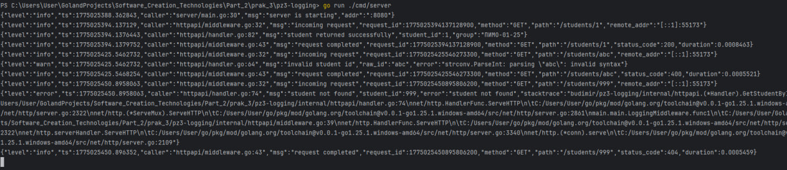
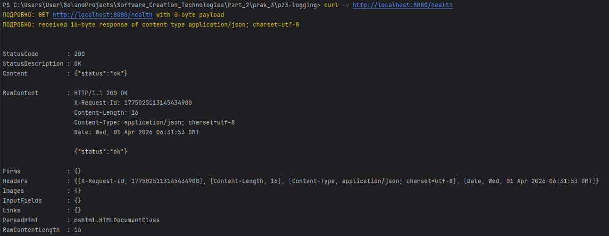
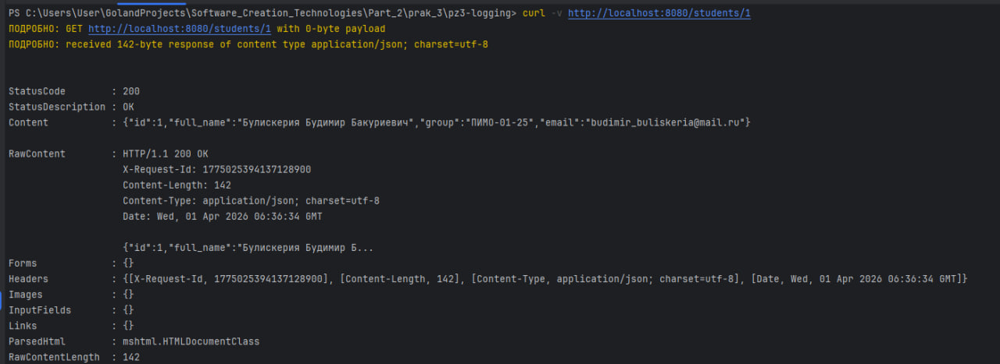
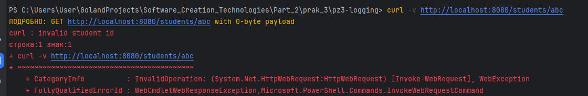
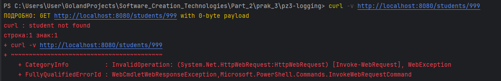
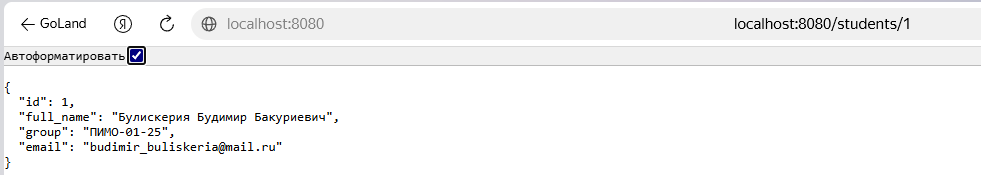

# Практическое занятие №3: Логирование с zap

Структурированное логирование в backend-приложении на Go с использованием библиотеки `zap`.

## 🎯 Цель работы

Освоить организацию структурированного логирования в Go-приложении: настройка `zap`, логирование HTTP‑запросов, добавление контекстных полей, уровни логирования.

## 🧩 Выполненные задачи

- Создано HTTP‑приложение с двумя эндпоинтами: `/health` и `/students/{id}`.
- Настроен структурированный логгер `zap` с выводом в JSON в консоль.
- Реализован middleware для логирования входящих/исходящих запросов.
- Добавлены поля: `method`, `path`, `status_code`, `duration`, `request_id`.
- Логируются ошибки с дополнительным контекстом (`student_id`, `raw_id`).
- **Дополнительное задание (вариант 2)**: в ответ добавлен заголовок `X-Request-Id`, который генерируется для каждого запроса и фиксируется в логах.

## 📁 Структура проекта

```markdown
pz3-logging/
├── cmd/server/main.go
├── internal/
│ ├── httpapi/
│ │ ├── handler.go
│ │ ├── middleware.go
│ │ └── response_writer.go
│ └── student/
│ ├── model.go
│ └── repo.go
├── pkg/logger/logger.go
├── go.mod
└── README.md
```


# 🚀 Запуск

```bash
go run ./cmd/server
```


## Health check
```bash
curl -v http://localhost:8080/health
```


## Получить студента с ID=1
```bash
curl -v http://localhost:8080/students/1
```


## Неверный ID
```bash
curl -v http://localhost:8080/students/abc
```


## Несуществующий ID
```bash
curl -v http://localhost:8080/students/999
```


## Доп задание
### Вариант 2 Добавить поле request_id в ответ
Передавайте идентификатор запроса не только в лог, но и в HTTP-заголовок ответа.
```bash
StatusCode        : 200
StatusDescription : OK
Content           : {"id":1,"full_name":"Булискерия Будимир Бакуриевич","group":"ПИМО-01-25","email":"budimir_buliskeria@mail.ru"}

RawContent        : HTTP/1.1 200 OK
                    X-Request-Id: 1775026853341407700
                    Content-Length: 142
                    Content-Type: application/json; charset=utf-8
                    Date: Wed, 01 Apr 2026 07:00:53 GMT

                    {"id":1,"full_name":"Булискерия Будимир Б...
Forms             : {}
Headers           : {[X-Request-Id, 1775026853341407700], [Content-Length, 142], [Content-Type, application/json; charset=utf-8], [Date, Wed, 01 Apr 2026 07:00:53 GMT]}
Images            : {}
InputFields       : {}
Links             : {}
ParsedHtml        : mshtml.HTMLDocumentClass
RawContentLength  : 142

```


## Ответы на контрольные вопросы

### 1. Зачем backend-приложению нужно логирование?
    Логирование — это один из основных инструментов наблюдаемости (observability) серверного приложения. Оно позволяет:

Фиксировать события, происходящие в системе: запуск, остановка, обработка запросов, ошибки.

Помогать разработчикам и администраторам диагностировать проблемы в реальном времени и постфактум.

Отслеживать производительность (время обработки, количество запросов).

Обеспечивать аудит и понимание поведения системы в production-среде, где отладчик использовать нельзя.

Без логов невозможно эффективно сопровождать сложное backend-приложение, так как не будет данных для анализа инцидентов.

### 2. Чем обычный текстовый лог отличается от структурированного?
    Обычный текстовый лог — это просто строки, например:
   "user 15 requested /orders at 10:31".
   Такой формат удобен для чтения человеком, но сложен для автоматической обработки: трудно фильтровать по полям, строить агрегации, быстро искать по конкретному пользователю или коду ошибки.

Структурированный лог — каждая запись представляет собой набор полей в формате ключ-значение, часто в JSON.
Пример: {"level":"info","msg":"request completed","method":"GET","path":"/orders","status":200,"duration":0.5}.
Это позволяет легко парсить, индексировать и анализировать логи в системах вроде ELK, Loki, Splunk. Поиск по конкретному полю (student_id=1) становится простым.

### 3. Что означает structured logging?
Structured logging (структурированное логирование) — это подход, при котором логи пишутся не как произвольный текст, а как набор структурированных данных (обычно ключ-значение).
    Вместо одной строки каждое событие описывается полями:

сообщение (message)

уровень (severity)

контекстные атрибуты (user_id, request_id, duration, status_code и т.д.)

Это позволяет машинам (системам сбора логов) легко обрабатывать записи, а разработчикам — быстро фильтровать и находить нужные события без сложного парсинга строк.

### 4. Какие уровни логирования используются в этой работе?
    В практической работе используются следующие уровни (severity levels) библиотеки zap:

Debug — для детальной отладочной информации (например, "health endpoint called"). В production обычно отключён.

Info — для нормальных рабочих событий (старт сервера, успешная обработка запроса, успешное получение студента).

Warn — для ситуаций, которые отклоняются от нормы, но приложение продолжает работать (неверный метод, неверный формат ID).

Error — для ошибок, которые нарушают выполнение операции (студент не найден).

Уровни помогают управлять объёмом логов и быстро фокусироваться на проблемах.

### 5. Почему полезно логировать HTTP-метод, путь и статус ответа?
   Логирование этих полей даёт контекст о каждом запросе:

Метод и путь позволяют понять, какая операция выполнялась (например, GET /students/1).

Статус ответа показывает, успешно ли завершился запрос (200, 400, 404, 500 и т.д.).

Благодаря этому можно:

Отслеживать, какие эндпоинты наиболее часто вызываются.

Быстро выявлять клиентские ошибки (400, 404) и серверные сбои (500).

Сопоставлять запрос с ответом при анализе инцидентов.

Строить метрики (например, процент ошибок на маршрут).

### 6. Зачем в лог добавляют время выполнения запроса?
    Время выполнения (duration) — критическая метрика производительности. Оно позволяет:

Определять медленные эндпоинты и узкие места.

Выявлять деградацию производительности после развёртывания новых версий.

Устанавливать пороги (SLO) и получать уведомления, если запросы начинают обрабатываться дольше нормы.

При диагностике проблем: если запрос занял много времени, это может указывать на проблемы с БД, внешними API или блокировки.

В логах это поле хранится в машиночитаемом формате (например, duration: 0.123s), что упрощает построение графиков и анализ.

### 7. Почему логирование ошибок должно содержать дополнительный контекст?
    Одна строка "error: student not found" бесполезна без контекста.
    Добавление полей (например, student_id, request_id, path, user_id) позволяет:

Быстро понять, какой именно студент не найден.

Восстановить последовательность действий пользователя.

Связать ошибку с конкретным запросом (через request_id).

Увидеть где произошла ошибка (в каком обработчике, какая функция).

Контекст превращает сырое сообщение об ошибке в полезную информацию, необходимую для исправления бага или понимания поведения системы.

### 8. В чём практическое преимущество zap?
    zap позиционируется как быстрый, структурированный, уровневый логгер с низким потреблением ресурсов. Его практические преимущества:

Высокая производительность — минимальное выделение памяти и низкое влияние на время обработки запросов.

Два API — Logger (максимальная скорость) и SugaredLogger (удобство, небольшой оверхед).

Строгая типизация полей — поля задаются через методы типа zap.Int64, zap.String, что снижает вероятность ошибок.

Гибкая конфигурация — можно легко переключаться между JSON-форматом, текстовым форматом, записью в файл, stderr и т.д.

Широкое распространение в промышленной разработке, хорошая документация.

В отличие от стандартного log или logrus, zap предлагает лучшую производительность и более строгий подход к структурированным логам.

### 9. Что означает maintenance mode у logrus?
   Maintenance mode означает, что библиотека logrus больше не получает активных новых возможностей (features), а только поддерживается: исправляются критические ошибки и проблемы безопасности, но новые функции не добавляются.

Разработчики logrus объявили об этом в официальном репозитории. Это сигнал, что для новых проектов лучше выбирать активно развивающиеся альтернативы, такие как zap или slog (встроенный в Go 1.21+). Однако logrus по-прежнему стабилен и используется во многих существующих проектах.

### 10. Почему structured logging особенно важен для микросервисов и backend API?
    В микросервисной архитектуре и сложных backend‑системах:

Множество сервисов — логи децентрализованы, их необходимо агрегировать в единую систему (ELK, Loki).

Большой объём — миллионы запросов в день, автоматическая фильтрация и поиск критичны.

Распределённая трассировка — structured logs легко дополняются полями trace_id, span_id, позволяя восстановить цепочку вызовов между сервисами.

Быстрая диагностика — аналитики и разработчики могут использовать запросы по полям (например, status >= 500 AND service="auth"), а не грепать по строкам.

Автоматическая обработка — системы мониторинга могут извлекать метрики из логов (например, среднее время ответа по маршрутам).