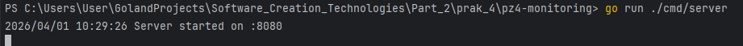
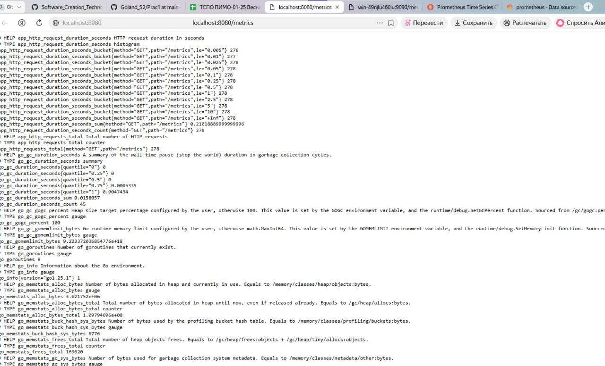
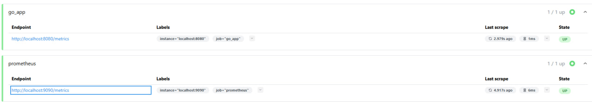
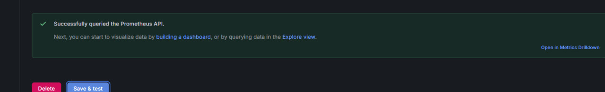
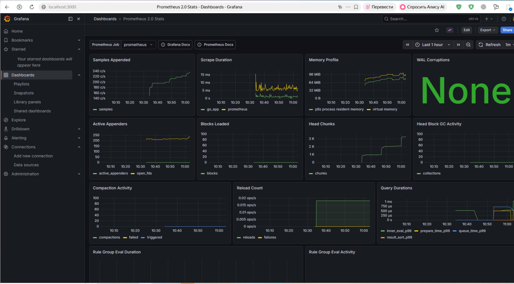
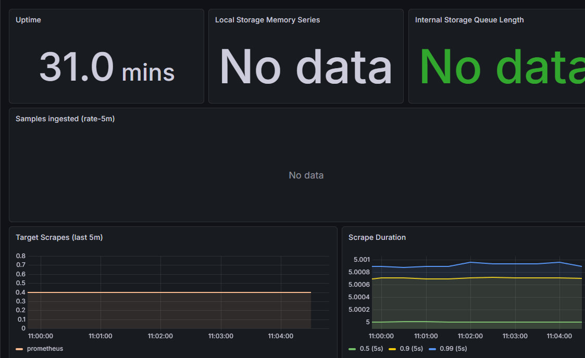

# Практическое занятие №4: Мониторинг с Prometheus и Grafana

Настройка мониторинга Go-приложения с экспортом метрик в Prometheus и визуализацией в Grafana.

## 🎯 Цель работы

Освоить базовую организацию мониторинга backend-приложения: экспорт метрик, сбор Prometheus, визуализация в Grafana.

## 🧩 Выполненные задачи

- Создано HTTP-приложение на Go с эндпоинтами `/health`, `/students/{id}` и `/metrics`.
- Интегрирована клиентская библиотека Prometheus.
- Реализованы метрики:
    - `app_http_requests_total` — счётчик всех запросов (метод, путь).
    - `app_http_errors_total` — счётчик ошибок (метод, путь, статус).
    - `app_http_request_duration_seconds` — гистограмма времени обработки.
- **Дополнительное задание (вариант 2)**: добавлена отдельная гистограмма `app_student_request_duration_seconds` для маршрута `/students/{id}` с лейблом `student_id`.
- Настроен Prometheus для сбора метрик.
- Prometheus подключён как источник данных в Grafana.
- Создан базовый дашборд с графиками.

## 📁 Структура проекта
```markdown
pz4-monitoring/
├── cmd/server/main.go
├── internal/
│ ├── httpapi/
│ │ ├── handler.go
│ │ ├── middleware.go
│ │ └── response_writer.go
│ ├── metrics/metrics.go
│ └── student/
│ ├── model.go
│ └── repo.go
├── monitoring/prometheus.yml
├── go.mod
└── README.md
```

## 🚀 Запуск

### 1. Go-приложение
```bash
go run ./cmd/server
```

```bash
Проверка метрик: http://localhost:8080/metrics
```

### 2. Prometheus
```bash
prometheus --config.file=monitoring/prometheus.yml
```


### 3. Grafana
```bash
Интерфейс: http://localhost:3000 (логин admin/admin)
```

### 🧪 Генерация нагрузки
```bash
for i in {1..20}; do curl http://localhost:8080/health; done
for i in {1..15}; do curl http://localhost:8080/students/1; done
for i in {1..5}; do curl http://localhost:8080/students/999; done
```
### 📈 Примеры PromQL
```markdown
Общее число запросов: sum(app_http_requests_total)

Ошибки: sum(app_http_errors_total)

Средняя длительность за последнюю минуту:

text
sum(rate(app_http_request_duration_seconds_sum[1m])) / sum(rate(app_http_request_duration_seconds_count[1m]))
Запросы по студентам: sum by (student_id) (app_student_request_duration_seconds_count)
```

### 🔍 Дополнительное задание (вариант 2)
Отдельная гистограмма app_student_request_duration_seconds записывает время обработки только для запросов, путь которых начинается с /students/. В лейбле student_id сохраняется идентификатор из URL. Это позволяет анализировать производительность для каждого студента индивидуально.


# Контрольные вопросы
## 1. Что такое метрики приложения?
Метрики — это числовые показатели, характеризующие состояние и поведение приложения во времени. Они позволяют наблюдать за системой в целом, выявлять тренды и аномалии.
Примеры метрик для backend‑приложения: количество HTTP‑запросов, число ошибок, длительность обработки запросов, использование памяти, количество активных соединений. Метрики собираются автоматически и обычно агрегируются (суммы, средние, перцентили), что даёт возможность оценить общее состояние сервиса без необходимости анализировать каждый отдельный лог.

## 2. Чем метрики отличаются от логов?
Логи:
```markdown
Отвечают на вопрос: «Что именно произошло?» (конкретное событие)

Содержат текстовые сообщения и структурированные поля

Каждая запись уникальна и представляет единичное событие

Используются для детальной отладки и расследования инцидентов
```
Метрики:
```markdown
Отвечают на вопрос: «Как система ведёт себя в целом?» (тенденции, агрегаты)

Содержат только числовые значения с метками (лейблами)

Хранятся как временные ряды (значение за интервал)

Используются для мониторинга, алертинга и долгосрочного анализа производительности
```
Оба инструмента дополняют друг друга: логи помогают разобраться в отдельной проблеме, а метрики позволяют вовремя заметить, что проблема возникла и насколько она серьезна.

## 3. Какую роль выполняет Prometheus?
Prometheus — это система мониторинга, которая:

Собирает метрики путём регулярного опроса (scraping) HTTP‑эндпоинтов приложений.

Хранит метрики как временные ряды в собственной базе данных.

Предоставляет язык запросов PromQL для анализа данных.

Может генерировать алерты на основе пороговых значений.

В экосистеме Prometheus приложение не отправляет метрики самостоятельно, а предоставляет их по HTTP, а Prometheus сам приходит за ними с заданным интервалом.

## 4. Что такое scraping в Prometheus?
Scraping (сбор) — это процесс, при котором Prometheus периодически опрашивает (выполняет HTTP‑запрос) указанные в конфигурации цели (targets) по эндпоинту /metrics и забирает оттуда метрики.
Параметры сбора (интервал, таймауты) задаются в файле prometheus.yml.
После успешного scraping’а полученные данные сохраняются как временные ряды.

## 5. Зачем приложению маршрут /metrics?
Маршрут /metrics предоставляет экспозицию метрик в формате, понятном Prometheus (простой текстовый формат).
Без этого эндпоинта Prometheus не сможет получить данные о состоянии приложения.
В Go‑приложении его легко добавить с помощью promhttp.Handler(), который автоматически выводит все зарегистрированные метрики.

## 6. Что делает promhttp.Handler()?
promhttp.Handler() возвращает стандартный http.Handler, который при обращении к нему возвращает текущие значения всех зарегистрированных метрик в формате exposition Prometheus.
Этот обработчик обычно подключается к маршруту /metrics и используется Prometheus для scraping’а.
Он автоматически собирает метрики из глобального реестра (prometheus.DefaultGatherer), если метрики были зарегистрированы через promauto или явно.

## 7. Для чего нужна Grafana?
Grafana — это платформа для визуализации данных. Она не собирает метрики сама, а подключается к источникам данных (например, Prometheus, InfluxDB, Elasticsearch) и строит на их основе дашборды — графики, таблицы, диаграммы.
Grafana делает наблюдаемость наглядной, позволяя быстро увидеть динамику нагрузки, ошибок, задержек и других показателей.

## 8. Какие три основные метрики реализованы в этой работе?
В работе реализованы три базовые метрики:
```markdown
app_http_requests_total (Counter) — общее количество HTTP‑запросов, разбитое по методам и путям.

app_http_errors_total (Counter) — количество ответов с HTTP‑статусом ≥400, с дополнительными метками method, path, status_code.

app_http_request_duration_seconds (Histogram) — распределение времени обработки запросов в секундах, позволяет вычислять средние значения, перцентили и т.д.
```

## 9. Что показывает Histogram?
Histogram (гистограмма) — это тип метрики, который измеряет распределение значений.
В отличие от простого счётчика или gauge, гистограмма собирает данные по заранее заданным интервалам (buckets) и позволяет вычислять:

количество наблюдений;

сумму всех значений;

квантили (например, 95-й перцентиль времени ответа).

В работе гистограмма app_http_request_duration_seconds показывает, сколько запросов укладываются в определённые диапазоны времени, что важно для понимания производительности.

## 10. Почему мониторинг важен для сопровождения backend-приложений?
    Мониторинг даёт объективную картину работы системы в реальном времени и в ретроспективе. Без него:

Нельзя вовремя заметить рост числа ошибок или увеличение времени ответа.

Сложно планировать ресурсы (капасити) — не видно, как меняется нагрузка.

Трудно выявлять деградацию после обновлений.

Алертинг становится невозможным: система не может сама сообщить о проблеме.

Мониторинг вместе с логированием и трейсингом составляет основу наблюдаемости (observability), которая позволяет поддерживать надёжность сервиса в условиях эксплуатации.