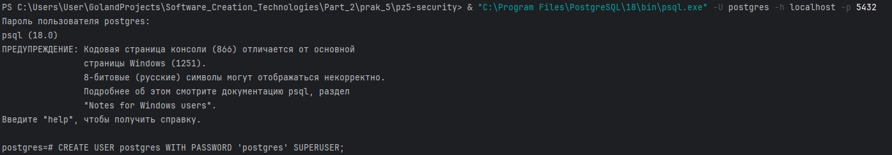
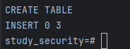
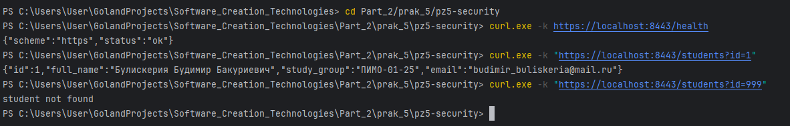
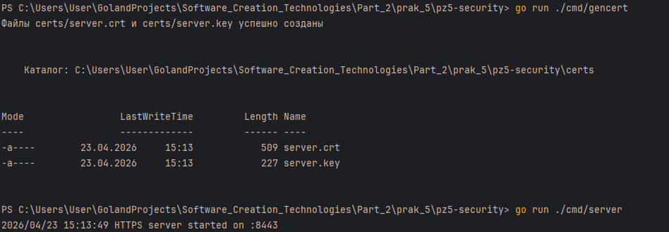

# Практическая работа №5 — HTTPS и защита от SQL-инъекций на Go


## 📚 Содержание
- [Цели работы](#цели-работы)
- [Требования](#требования)
- [Структура проекта](#структура-проекта)
- [Инструкция по запуску](#инструкция-по-запуску)
    - [1. Клонирование и настройка модуля](#1-клонирование-и-настройка-модуля)
    - [2. Подготовка базы данных PostgreSQL](#2-подготовка-базы-данных-postgresql)
    - [3. Генерация TLS-сертификатов](#3-генерация-tls-сертификатов)
    - [4. Конфигурация подключения к БД](#4-конфигурация-подключения-к-бд)
    - [5. Запуск сервера](#5-запуск-сервера)
- [Проверка работы](#проверка-работы)

- [Контрольные вопросы](#контрольные-вопросы)

## 🎯 Цели работы
- Освоить включение HTTPS через TLS-сертификат в Go-приложении.
- Понять разницу между HTTP и HTTPS на транспортном уровне.
- Научиться предотвращать SQL-инъекции, используя параметризованные запросы и prepared statements.
- Получить практический навык безопасного взаимодействия с базой данных.

## 🔧 Требования
- **Go** версии 1.20 или выше.
- **PostgreSQL** 12+ (локальная установка).
- **OpenSSL** (опционально, если генерировать сертификаты вручную).
- **Git** (для клонирования репозитория).

> Проект не требует Docker – всё запускается нативно.

## 📁 Структура проекта
```markdown
pz5-security/
├── cmd/
│    └── server/
│    │      └── main.go
│    └── server/
│           └── main.go # точка входа
├── certs/ # TLS сертификат и ключ (создаются при настройке)
│ ├── server.crt
│ └── server.key
├── internal/
│ ├── config/
│ │ └── config.go # конфигурация приложения
│ ├── httpapi/
│ │ └── handler.go # HTTP-обработчики
│ └── student/
│ ├── model.go # структура данных студента
│ └── repo.go # репозиторий для работы с БД
├── sql/
│ └── init.sql # инициализация таблиц и тестовых данных
├── go.mod
├── go.sum
└── README.md
```

## 🚀 Инструкция по запуску

### 1. Клонирование и настройка модуля
Склонируйте репозиторий и перейдите в папку проекта:
```bash
git clone <repo-url> pz5-security
cd pz5-security
```
### Инициализируйте модуль и установите драйвер PostgreSQL:

```bash
go mod init example.com/pz5-security
go get github.com/lib/pq
```

### 2. Подготовка базы данных PostgreSQL
   Убедитесь, что сервер PostgreSQL запущен (в Windows: Get-Service postgresql* должен показывать статус Running).

Подключитесь к консоли psql:
```bash
psql -U postgres -h localhost -p 5432
```

### Создайте базу данных и выйдите:
```sql
CREATE DATABASE study_security OWNER postgres;
\q
```


### Выполните скрипт sql/init.sql для создания таблиц и начальных данных:
```bash
psql -U postgres -d study_security -f sql/init.sql
```
(Если появляется ошибка кодировки (русские символы неверно отображаются), перед выполнением скрипта установите в psql кодировку клиента:)
```sql
SET client_encoding = 'UTF8';
\i sql/init.sql
```
### 3. Генерация TLS-сертификатов
Сервер требует PEM-файлы сертификата и ключа. Выберите один из способов:

Способ A – с помощью OpenSSL (если установлен):
```bash
openssl req -x509 -newkey rsa:2048 -nodes -keyout certs/server.key -out certs/server.crt -days 365 -subj "/CN=localhost"
```

Способ B – с помощью Go (если OpenSSL нет):
Создайте в корне проекта файл gencert.go с таким содержимым:
Запустите генератор:
```bash
go run gencert.go
```
После этого файл gencert.go можно удалить.

Убедитесь, что в папке certs появились непустые файлы server.crt и server.key.
### 4. Конфигурация подключения к БД
Откройте internal/config/config.go и проверьте строку DSN. Она должна содержать правильный пароль пользователя postgres:

### 5. Запуск сервера
   Из корня проекта выполните:

```bash
go run ./cmd/server
После успешной загрузки в консоли появится:
``````
```text
HTTPS server started on https://localhost:8443
```
Сервер готов принимать запросы.

## 🧪 Проверка работы
Healthcheck
```bash
curl -k https://localhost:8443/health
```
Ответ: {"status":"ok","scheme":"https"}

Получение студента по ID
```bash
curl -k https://localhost:8443/students?id=1
```
Ответ:

```json
{"id":1,
  "full_name":"Булискерия Будимир Бакуриевич",
  "study_group":"ПИМО-01-25",
  "email":"budimir_buliskeria@mail.ru"
}
```
При запросе несуществующего студента (id=999) вернёт student not found.


📌 Дополнительное задание
HTTP-редирект на HTTPS
Добавьте HTTP-сервер на порту 8080, который перенаправляет все запросы на https://localhost:8443.



