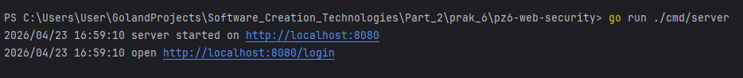
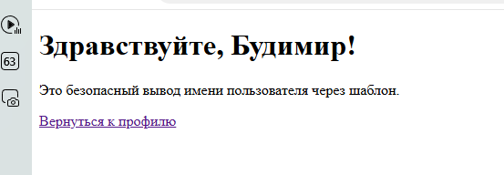
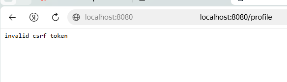
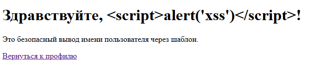

# Практическое занятие №6: Защита от CSRF/XSS и secure cookies

## Цель работы

Освоить базовые подходы к защите веб-приложения на Go от CSRF- и XSS-угроз, научиться безопасно использовать cookies для аутентификации и хранения состояния пользователя.

## Краткое описание угроз

- **CSRF (Cross-Site Request Forgery)** — атака, при которой браузер пользователя, уже авторизованного на сайте, отправляет нежелательный запрос от его имени. Сервер доверяет запросу, потому что в нём присутствует валидная сессионная cookie.
- **XSS (Cross-Site Scripting)** — внедрение вредоносного клиентского кода (обычно JavaScript) в страницу, которую затем просматривают другие пользователи. Возникает, когда приложение выводит пользовательские данные в HTML без экранирования.

## Роль защитных атрибутов cookies

- **HttpOnly** — запрещает доступ к cookie из JavaScript (снижает риск кражи через XSS).
- **Secure** — cookie передаётся только по HTTPS.
- **SameSite** — ограничивает отправку cookie в межсайтовых запросах (помогает против CSRF).

## Структура проекта


```markdown
pz6-web-security/
├── cmd/
│ └── server/
│ └── main.go
├── internal/
│ ├── auth/
│ │ ├── cookie.go
│ │ └── csrf.go
│ ├── httpapi/
│ │ └── handler.go
│ └── store/
│ └── store.go
├── templates/
│ ├── profile.html
│ └── hello.html
├── go.mod
└── README.md
```


## Реализованные механизмы защиты

- Secure cookies с атрибутами `HttpOnly`, `SameSite=Lax`.
- CSRF-токен, генерируемый сервером, встроенный в форму и проверяемый при POST-запросах.
- Безопасный вывод пользовательского имени через HTML-шаблоны (`html/template`), экранирующий потенциально опасные символы.

## Запуск

```bash
cd pz6-web-security
go run ./cmd/server
```
Сервер стартует на http://localhost:8080.

## Проверка сценариев
### Вход
Откройте http://localhost:8080/login.
Создаётся сессия, устанавливается cookie session_id, происходит перенаправление на /profile.

### Редактирование профиля
На странице /profile выведите текущее имя «Студент» и скрытое поле csrf_token.
Введите новое имя (например, «Иван») и нажмите «Сохранить».
После успешной проверки токена имя обновится и откроется страница приветствия.

### Проверка CSRF-защиты
Отправьте POST-запрос на /profile без токена или с неверным токеном.
Сервер вернёт 403 Forbidden с сообщением invalid csrf token.

### Проверка XSS-защиты
В поле имени введите строку <script>alert('xss')</script> и сохраните.
На странице /hello вы увидите эту строку как обычный текст; скрипт не выполнится.


## Выводы
CSRF-уязвимости возникают из-за избыточного доверия сервера к автоматической отправке cookies.

XSS-уязвимости возникают из-за избыточного доверия к данным, выводимым в HTML.

Безопасное веб-приложение обязано: осторожно настраивать cookies, проверять CSRF-токены для действий, изменяющих состояние, и экранировать пользовательский ввод при выводе в HTML.