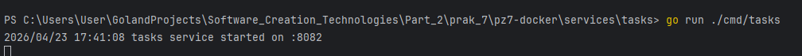
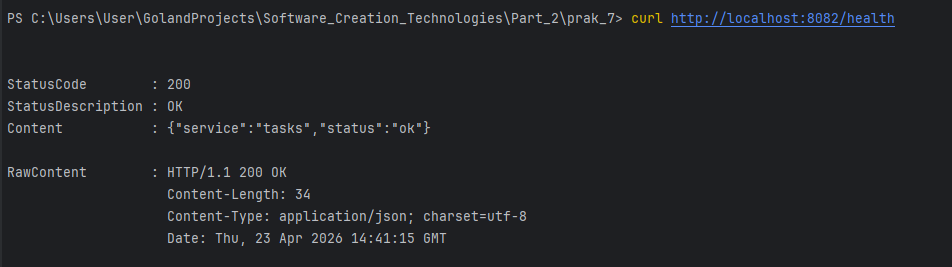
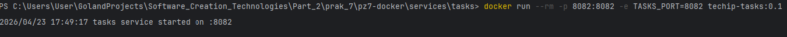
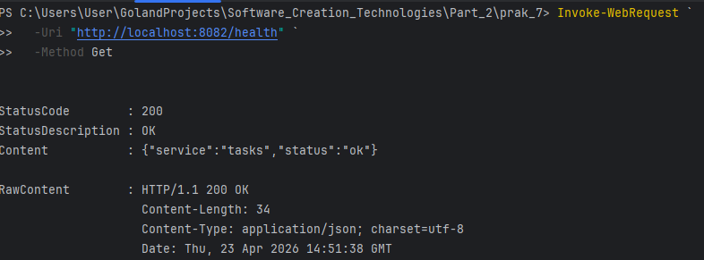

# pz7-docker — Учебный сервис tasks (Docker-контейнеризация)

Проект демонстрирует контейнеризацию простого backend-сервиса на Go с использованием Docker и Docker Compose. Сервис `tasks` отдаёт JSON-ответ на `GET /health`.

## Структура проекта
```markdown
pz7-docker/
├── services/
│ └── tasks/
│ ├── cmd/tasks/main.go # точка входа
│ ├── internal/ # (опционально) внутренние пакеты
│ ├── go.mod
│ ├── go.sum
│ ├── Dockerfile
│ └── .dockerignore
├── deploy/
│ └── docker-compose.yml
└── README.md
```

## Требования
- Go 1.23+ (для локального запуска)
- Docker Desktop (для контейнеризации)

## Локальный запуск (без Docker)
```bash
cd services/tasks
go run ./cmd/tasks
```
Сервис слушает :8082

### Проверка:

```bash
curl http://localhost:8082/health
# {"status":"ok","service":"tasks"}
```


### Запуск в Docker
Сборка образа
```bash
cd services/tasks
```
docker build -t techip-tasks:0.1 .
### Запуск контейнера
```bash
docker run --rm -p 8082:8082 -e TASKS_PORT=8082 techip-tasks:0.1
```


### Запуск через Docker Compose
```bash
cd deploy
docker compose up -d --build
# Проверка: curl http://localhost:8082/health
# Остановка: docker compose down
```

### Назначение файлов
Dockerfile — multi-stage build: сборка бинарника в golang-образе, запуск в минимальном alpine.

.dockerignore — исключает мусор из контекста сборки.

docker-compose.yml — описывает сервис, порты и переменные окружения.
