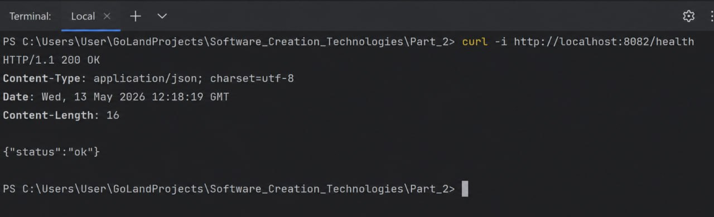
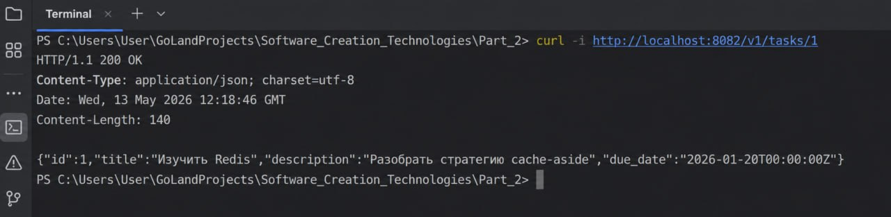
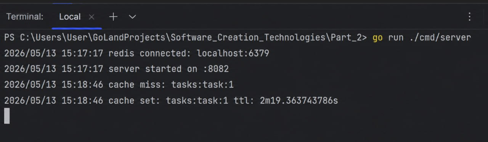
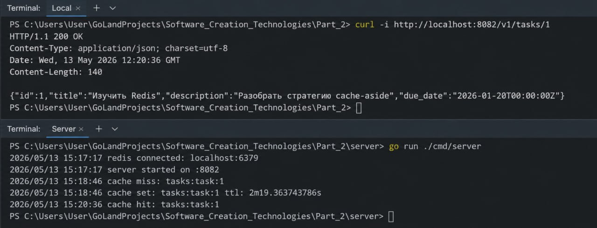
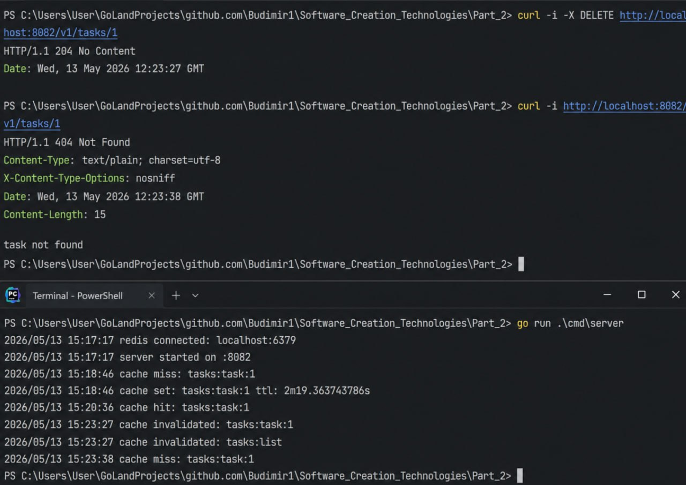
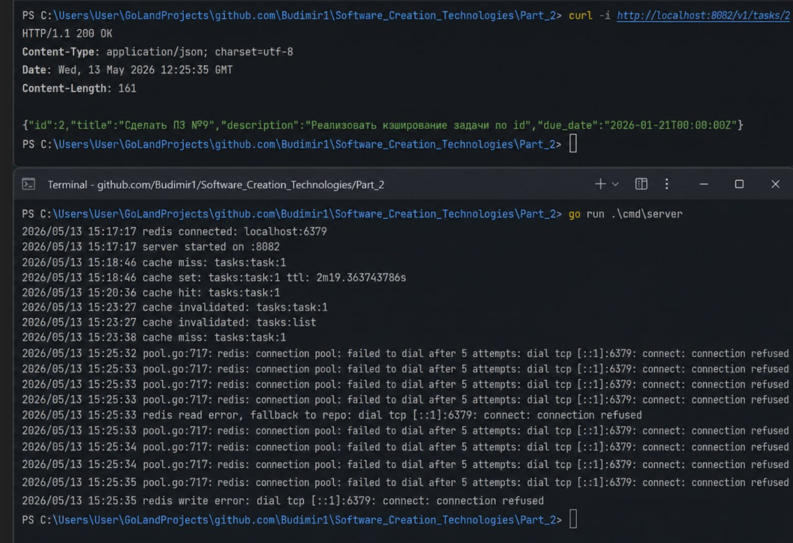

# Практическое занятие №9 — Redis cache-aside на Go

Проект реализует backend-сервис `tasks` на Go с распределённым кэшем Redis.
Главный сценарий практики: чтение задачи по `id` через стратегию `cache-aside`.

## Что реализовано

- `GET /v1/tasks/{id}` — чтение задачи по id.
- `GET /v1/tasks` — список задач для удобной проверки.
- `POST /v1/tasks` — создание учебной задачи.
- `PATCH /v1/tasks/{id}` — обновление задачи и инвалидация кэша.
- `DELETE /v1/tasks/{id}` — удаление задачи и инвалидация кэша.
- Redis-кэш по ключу `tasks:task:<id>`.
- TTL + jitter.
- Логирование `cache hit`, `cache miss`, `cache set`, `cache invalidated`.
- Устойчивое поведение при недоступности Redis: сервис продолжает читать данные из основного репозитория.

## Структура проекта

```text
pz9-redis-cache/
├── cmd/
│   └── server/
│       └── main.go
├── deploy/
│   └── redis/
│       └── docker-compose.yml
├── internal/
│   ├── cache/
│   │   ├── keys.go
│   │   ├── redis.go
│   │   └── ttl.go
│   ├── config/
│   │   └── config.go
│   ├── httpapi/
│   │   └── handler.go
│   ├── service/
│   │   └── task_service.go
│   └── task/
│       ├── model.go
│       └── repo.go
├── .gitignore
├── go.mod
└── README.md
```

## Подготовка на macOS
```bash
go version
docker --version
docker compose version
```

Зависимость Redis-клиента:

```bash
go get github.com/redis/go-redis/v9
go mod tidy
```

## Запуск Redis

На macOS используем `/`, а не `\` в путях:

```bash
cd deploy/redis
docker compose up -d
docker compose ps
cd ../..
```

## Запуск сервера

```bash
go run ./cmd/server
```

Ожидаемый лог:

```text
redis connected: localhost:6379
server started on :8082
```

Если Redis выключен, сервис всё равно стартует, но покажет предупреждение.

## Проверка health endpoint

```bash
curl -i http://localhost:8082/health
```

Ожидаемый ответ:

```json
{"status":"ok"}
```

## Проверка cache miss и cache set

Первый запрос:

```bash
curl -i http://localhost:8082/v1/tasks/1
```

Ожидаемый ответ:

```json
{"id":1,"title":"Изучить Redis","description":"Разобрать стратегию cache-aside","due_date":"2026-01-20T00:00:00Z"}
```

В логах сервера должно быть примерно:

```text
cache miss: tasks:task:1
cache set: tasks:task:1 ttl: 2m...
```

## Проверка cache hit

Второй раз выполняестся тот же запрос:

```bash
curl -i http://localhost:8082/v1/tasks/1
```

В логах должно быть:

```text
cache hit: tasks:task:1
```

## Проверка ключа в Redis

```bash
docker exec -it redis_cache redis-cli
```

Внутри Redis CLI:

```redis
KEYS tasks:*
TTL tasks:task:1
GET tasks:task:1
EXIT
```

## Проверка инвалидации после PATCH

```bash
curl -i -X PATCH http://localhost:8082/v1/tasks/1 \
  -H "Content-Type: application/json" \
  -d '{"title":"Обновлённая задача","description":"Новый текст","due_date":"2026-01-22T00:00:00Z"}'
```

Ожидаемый лог:

```text
cache invalidated: tasks:task:1
```

После этого снова выполним:

```bash
curl -i http://localhost:8082/v1/tasks/1
```

Теперь снова будет `cache miss`, потом `cache set`, потому что старый ключ был удалён.

## Проверка удаления

```bash
curl -i -X DELETE http://localhost:8082/v1/tasks/1
```

После удаления:

```bash
curl -i http://localhost:8082/v1/tasks/1
```

Ожидаемый результат:

```text
HTTP/1.1 404 Not Found
```

## Проверка fallback при остановке Redis

Остановим Redis:

```bash
cd deploy/redis
docker compose stop
cd ../..
```

Проверим задачу, которая ещё есть в основном репозитории:

```bash
curl -i http://localhost:8082/v1/tasks/2
```

Сервис должен вернуть задачу из основного репозитория, а в логах будет ошибка Redis:

```text
redis read error, fallback to repo: ... connection refused
redis write error: ... connection refused
```

Это правильное поведение: Redis не является источником истины, он только ускоряет повторное чтение.


Пример запуска с коротким TTL:

```bash
CACHE_TTL=10s CACHE_TTL_JITTER=5s go run ./cmd/server
```
## Скриншоты:

----

----

----

----

----

----

----


## Контрольные вопросы

### 1. Что такое cache-aside?

`Cache-aside` — это стратегия, при которой приложение сначала пытается прочитать данные из кэша. Если данных нет, приложение читает их из основного хранилища, кладёт результат в кэш и возвращает клиенту.

### 2. Почему Redis не должен быть источником истины?

Redis используется как ускоритель чтения. Он может быть очищен, перезапущен или временно недоступен. Канонические данные должны находиться в основном хранилище.

### 3. Зачем нужен TTL?

TTL ограничивает время жизни ключа. Благодаря этому кэш самоочищается и не хранит устаревшие данные бесконечно.

### 4. Что такое jitter?

Jitter — это случайная прибавка к TTL. Она нужна, чтобы ключи истекали не одновременно.

### 5. Почему одинаковый TTL для всех ключей может быть проблемой?

Если много ключей истечёт одновременно, большое число запросов резко пойдёт в основное хранилище. Это может создать всплеск нагрузки.

### 6. Как должен вести себя сервис при недоступности Redis?

Сервис должен записать ошибку в лог и продолжить работу через основной репозиторий. Клиент не должен получать ошибку только из-за отказа Redis.

### 7. Почему кэш нужно инвалидировать после изменения данных?

После изменения или удаления данные в кэше могут стать устаревшими. Поэтому связанный ключ нужно удалить.

### 8. Чем кэширование одной сущности проще, чем кэширование списка?

У одной сущности понятный ключ и простая инвалидация. Список сложнее, потому что он может зависеть от фильтров, пагинации и сортировки.

### 9. В чём смысл ключа `tasks:task:<id>`?

Такой ключ понятен, стабилен и показывает домен, тип сущности и идентификатор.

### 10. Почему Redis рассматривается как внешняя инфраструктурная зависимость?

Redis работает отдельно от Go-приложения и доступен по сети. Его могут использовать несколько экземпляров сервиса.
